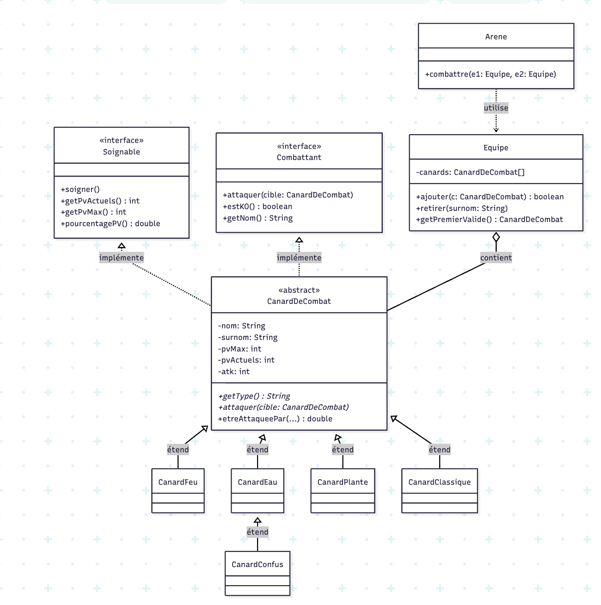
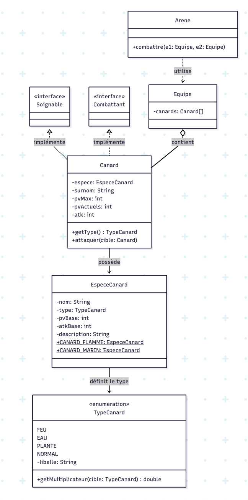

# Coin-Coin-Arena-Aurel-GEORGES

## Section 1 - Architecture Partie A

Bon, j'ai répondu à chaque reflexion dans le fichier [REFLEXIONS.md](REFLEXIONS.md), mais pas vraiment aux questions que vous avez listées... Je laisse l'IA reformuler et compléter, je pense avoir bien compris les enjeux du TP à ce stade.

**Pourquoi CanardDeCombat est-elle abstraite ? Qu’empêche-t-on et que garantit-on ?**

La classe est abstraite pour empêcher l'instanciation d'un concept générique n'ayant pas de sens concret (un "Canard de Combat" générique sans type élémentaire ne peut pas exister dans le jeu). En contrepartie, cela garantit un contrat strict : toutes les sous-classes concrètes sont obligées d'implémenter les méthodes abstraites définies par la mère, comme getType() et attaquer(). Cela assure à l'arène que n'importe quel combattant fournira ces comportements de base

**Comment le polymorphisme rend-il attaquer possible dans la classe mère ?**

Dans la classe mère CanardDeCombat, la méthode attaquer(CanardDeCombat cible) est déclarée de manière abstraite (ou laisse le polymorphisme opérer via des délégations). Grâce au polymorphisme dynamique (la redéfinition), lors de l'exécution, Java ne se base pas sur le type statique déclaré de la variable, mais résout l'appel en fonction du type réel de l'objet en mémoire. Cela permet d'exécuter le code spécifique de la sous-classe (premier dispatch) qui invoquera ensuite la réaction spécifique de la cible (second dispatch), le tout sans utiliser la moindre condition if

**Quel est l’intérêt des interfaces si les méthodes existent déjà ?**

Les interfaces (Soignable, Combattant) permettent de découpler les capacités d'action d'un objet de sa stricte hiérarchie d'héritage. Si le code de l'arène s'appuie sur ces interfaces plutôt que sur la classe CanardDeCombat, il devient possible d'intégrer aux combats des entités totalement différentes (comme un dresseur ou un robot). Il suffira que ces nouvelles entités implémentent l'interface pour être acceptées par l'arène, sans aucune modification du système central

**Le problème de l’explosion combinatoire**
L'héritage nécessite de créer une nouvelle classe pour chaque variation de comportement. Si l'on combine des types élémentaires (Feu, Eau, Plante, Normal) avec des statuts modifiés (Confus, Enragé, etc.), le nombre de classes se multiplie. Pour 4 types et 3 comportements, il faudrait créer 12 sous-classes (ex: CanardFeuConfus, CanardPlanteEnrage, etc.). Cette limite rend le modèle difficile à maintenir et à étendre.

## Section 2 - Architecture Partie B

**Double dispatch éclaté (Partie A) vs table centralisée dans l'Enum (Partie B)**

Dans la Partie A, la table des multiplicateurs est dispersée à travers de multiples méthodes etreAttaqueePar réparties dans l'ensemble des sous-classes. Pour $N$ types, l'architecture génère $N^2$ méthodes de multiplicateurs. Ajouter un type (comme Électrique) oblige à modifier la classe mère et potentiellement toutes les sous-classes existantes. Dans la Partie B, cette logique est entièrement centralisée au sein de la méthode getMultiplicateur de l'énumération TypeCanard. L'ajout d'un nouveau type requiert uniquement la création d'une nouvelle ligne dans l'Enum et la mise à jour de sa table interne, offrant une maintenabilité très supérieure.

**Le pattern Flyweight et le partage des données d'espèce**

Dans la Partie A, l'instanciation de 50 canards de la même espèce entraîne la duplication en mémoire de leurs attributs de base (nom, attaque, PV max) 50 fois. La Partie B résout ce problème de redondance en implémentant le pattern Flyweight. Les données communes et immuables sont définies une seule fois au sein d'un objet partagé de type EspeceCanard (le modèle ou "template"). Les instances individuelles de Canard pointent toutes vers cet objet unique pour leurs statistiques de base, réduisant considérablement l'empreinte mémoire.

**Quelle version respecte le mieux l'Open/Closed Principle ?**

L'architecture par composition (Partie B) respecte le mieux ce principe. Dans la Partie A (héritage et double dispatch), l'ajout d'un type contraint à modifier le code existant dans la classe abstraite CanardDeCombat et dans toutes les sous-classes . Le code n'est donc pas fermé à la modification. Dans la Partie B, la classe concrète Canard n'a pas besoin d'être altérée lorsqu'un nouveau type est créé. L'extension du système se fait par le simple ajout d'une constante TypeCanard et de sa configuration, respectant parfaitement le principe "Ouvert à l'extension, fermé à la modification"

**Comment gérer les comportements spéciaux sans sous-classes ?**

Dans un système où Canard est l'unique classe concrète, la modélisation de comportements spéciaux (comme l'auto-attaque du CanardConfus) s'effectue idéalement via le pattern Strategy. Plutôt que de reposer sur un attribut booléen rigide ou une Enum d'état limitée, on injecte une interface de type ComportementAttaque dans la classe Canard. Le canard délègue son action d'attaque à l'implémentation de cette interface. Ce design est le plus extensible car il permet d'ajouter à volonté de nouvelles logiques (ex. AttaqueConfuse, AttaqueNormale) sous forme de classes séparées implémentant l'interface, et d'en changer dynamiquement à l'exécution sans modifier la structure du canard.

## Section 3 - Comparaison des deux approches

| Critère | Partie A (héritage) | Partie B (composition) |
| :--- | :--- | :--- |
| **Ajouter un nouveau type (ex. Électrique)** | 1 classe à créer (`CanardElectrique`). Modification de la classe mère et redéfinition de méthodes dans toutes les sous-classes existantes. | 0 classe à créer. Ajout d'une constante dans l'Enum `TypeCanard` et mise à jour de sa table interne. |
| **Ajouter un nouveau comportement (ex. Confus)** | Création d'une nouvelle sous-classe (ex. `CanardConfus` héritant de `CanardEau`). Risque d'explosion combinatoire avec les différents types. | Utilisation d'un attribut (ex. interface `ComportementAttaque`) dans la classe unique `Canard` sans créer de sous-classe. |
| **Deux canards de la même espèce en mémoire** | Les statistiques de base (PV, attaque) sont dupliquées et stockées dans chaque objet instancié. | Pattern Flyweight : les statistiques de base sont stockées dans une instance unique `EspeceCanard` partagée par tous les canards. |
| **Changer le type d'un canard à l'exécution** | Impossible. L'appartenance à une classe (héritage) est figée à l'instanciation. | Possible. Le type est une donnée (Enum) portée par l'objet, qui pourrait être modifiée dynamiquement. |
| **Nombre de `instanceof` nécessaires dans l'arène** | Au moins 1 (pour identifier un `CanardPlante` et appliquer sa régénération). | 0. On compare simplement la valeur de l'attribut (`canard.getType() == TypeCanard.PLANTE`) ou on délègue à l'Enum. |
| **Lisibilité du code pour un débutant** | Complexe en raison du mécanisme de double dispatch, où l'exécution rebondit entre plusieurs classes. | Meilleure. La logique (comme la table des types) est centralisée et la composition est plus intuitive à lire. |
| **Quand préférer cette approche ?** | Pour de petits projets figés où le nombre de types (ex. 4 fixes) et de comportements n'évoluera pas. | Pour des jeux évolutifs avec de nombreuses entités (18 types, dizaines d'espèces) nécessitant une forte maintenabilité. |

### 6. Choix d'architecture selon la taille du projet

* **Jeu avec 18 types et des dizaines d'espèces :** La Partie B (composition) s'impose. L'approche par héritage (Partie A) exigerait un grand nombre de méthodes de multiplicateurs pour gérer les combats, rendant le code difficilement maintenable. De plus, la Partie B utilise le pattern Flyweight pour centraliser les statistiques de base des dizaines d'espèces, optimisant ainsi l'utilisation de la mémoire en évitant les duplications.
* **Petit projet scolaire avec 4 types fixes :** La Partie A (héritage) est tout à fait acceptable. Puisque le nombre de types est limité à 4 et n'a pas vocation à évoluer, le défaut structurel du double dispatch vis-à-vis du principe "Ouvert/Fermé" (Open/Closed Principle) ne pose pas de problème concret.

### 7. Éviter le test conditionnel (if) sur le type Plante

* **Le constat :** Le fait que le comportement `regenerer()` du canard Plante soit géré par un `if` sur le type dans l'arène montre que le problème de conception a simplement été déplacé
* **La solution :** Pour éliminer ce `if`, chaque valeur de l'énumération `TypeCanard` doit définir son propre comportement via une méthode `finDeTour(Canard c)`. La constante `PLANTE` redéfinit spécifiquement cette méthode pour exécuter le soin, tandis que les autres types héritent d'un comportement par défaut (qui ne fait rien). L'appel devient alors purement polymorphique : `canard.getType().finDeTour(canard)`.